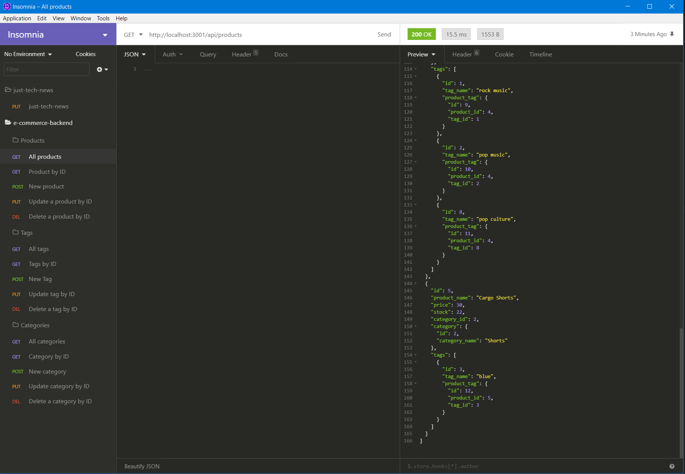

# E-Commerce Backend


## Description
This is a backend application that can be used by an E-commernce company. 


## Table of Contents
* [Installation](#installation)
* [Usage](#usage)
* [Sample](#sample)
* [License](#license)
* [Questions](#questions)

## Installation
Download the application and run:
```
npm i
npm i sequelize
npm i dotenv
npm install --save mysql2

```

## Usage
1. Run the following commands in your ternal window:
    - mysql -u root -p
    - source db/schema.sql;
    - quit
    - npm run seed
    - npm start
2. Once all the commands are done use Insomnia in order to execute the GET, POST, PUT, and DELETE functions. 

## Sample
Sample scheenshot:


Video demonstrating the application:https://drive.google.com/file/d/1Zn08lHhGWgnvADjbGvwVaQCEp8_t3jOK/view

## License
E-commerce backend is licensed under the MIT License.

## Questions
If you have any question please check out my GitHub https://github.com/antenorib1 or email me at antenorib1@gmail.com .
